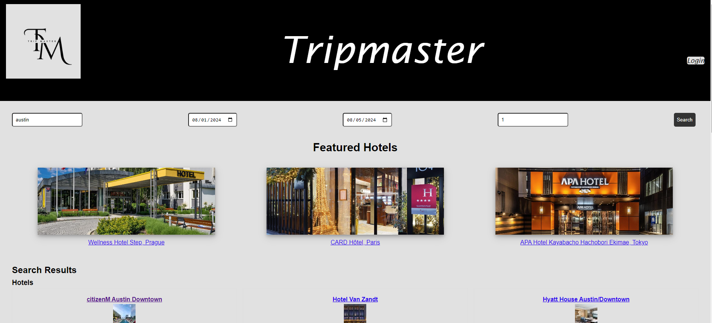

# Tripmaster


## Overview

Welcome to Tripmaster, a full-stack hotel search application developed collaboratively during our UT Austin Coding Boot Camp.

Tripmaster is your ultimate travel companion, designed to simplify the process of planning your trips. With Tripmaster, you can effortlessly search for hotels as well as login and register for an account, ensuring you have all the information you need to make informed decisions about your travel arrangements.

The motivation behind building Tripmaster stemmed from the desire to streamline the travel planning experience for users. Planning a trip can often be overwhelming, especially when it comes to finding the right accommodation. By developing Tripmaster, we aimed to provide a user-friendly solution that empowers travelers to easily search for and evaluate hotels, ultimately enhancing their overall trip planning experience.

Thank you for choosing Tripmaster for your travel planning needs!

## User Story

- **Hotel Search**: As a user, I want to search for hotels at my destination for specific dates and guest numbers, so that I can find the best accommodation for my needs.
- **Hotel Details**: As a user, I want to view detailed information about hotels, including photos, amenities, and reviews, so that I may make an informed booking decision.
- **Secure Login/Registration**: As a user, I want a secure way to sign-up and log in to my account so that my information is protected.

## Acceptance Criteria

- **Hotel Search Results**: Upon entering a destination, check-in and check-out dates, and the number of guests, the system should display relevant hotels, showcasing prices and amenities.
- **Hotel Details View**: When selecting a hotel from the search results, I should be presented with a detailed page that includes photos, a description, amenities, room types, and guest reviews.

- **Hotel Search Results**: Upon entering a city destination, check-in and check-out dates, and the number of guests, the system will display relevant hotels that are available within those specific dates as well showcase prices and numerical ratings.
- **Hotel Details View**: When selecting a hotel from the search results, the user will be presented with a detailed page for that specific hotel that includes photos, a description, amenities, room types, and guest reviews.
- **Login/Register**: When clicking on the Login link in the navigation, the user is prompted to either login or register for an account.
  - Upon registering for an account, the user is prompted to enter their name, email address, username, password, and to confirm their password.
  - Upon clicking the Register button, then the user's credentials are saved and they are logged into the site.

## Technologies Used

- Node.js
- Express.js
- Handlebars.js
- PostgreSQL
- Sequelize
- Booking.com API
- Express-session
- Cookies
- dotenv
- bcrypt
- express-handlebars

## Features

- **Comprehensive Search**: Utilize powerful search capabilities to find hotels that match your specific criteria.
- **Detailed Information**: Access in-depth details about hotels to make choices that best suit your preferences and budget.
- **User-Friendly Interface**: Enjoy a seamless and intuitive user experience designed to make travel planning as straightforward as possible.
- **User Authentication**: Secure sign-up and login functionality to manage user sessions.
- **Dynamic Rendering**: Utilizes Handlebars.js for a responsive and user-friendly interface, rendering blog content dynamically.
- **Interactive Design**: Accepts and responds to user input in real-time.
- **Responsive Design**: Ensures the application is accessible and function on various devices.
- **Deployment to Render**: Application is deployed to Render, ensuring it is accessibly online for users to engage with the content.

## Installation

To get started with Tripmaster, follow these simple steps:

1. Request an API key in order to use the Booking.com API.

   - Navigate to https://rapidapi.com/developer/dashboard
   - Select the app where you would like to create a key or replace a compromised key.
   - Navigate to the Authorization page.
   - Click Add authorization and add a name for your authorization.

2. Clone the repository to your local machine: `git clone https://github.com/kdolan28/Tripmaster.git`

3. Navigate to the project directory: `cd tripmaster`

4. Install the required dependencies: `npm install`
5. Set up environment variables by creating a `.env` file in the root directory and adding the following:
   ```
   DB_NAME='hotelhub_db'
   DB_USER='your_postgresql_username'
   DB_PASSWORD='your_postgresql_password'
   ```
6. Ensure that PostgreSQL is installed on your computer to initialize the database.

## Usage

To use the Tripmaster application, follow the following steps:

1. Open the Postgres Shell by typing the command `psql -U postgres` in the terminal.
2. Enter your user database password.
3. Create the `hotelhub_db` database by typing the command `\i db/schema.sql;` in the terminal.
4. Close out of the Postgres Shell by entering `\q` in the terminal.
5. Seed the database by entering `npm run seed` in the terminal.
6. Once your PostgreSQL database is active, navigate to the project directory and start the application by typing `npm start` in the terminal.
7. Open your web browser and visit `http://localhost:3000` to start planning your trip with Tripmaster.

### Screenshots

The following screenshot demonstrates the application's functionality and appearance:

**Application's homepage with hotel search results:**



**Example of hotel details that result after a search:**


**The application's Login/Registration page:**


## Links

GitHub Repository: https://github.com/kdolan28/Tripmaster

Deployed link to Render: https://tripmaster-josa.onrender.com

## Contributing

- Courtney Conde: https://github.com/cococnde
- Kyle Dolan: https://github.com/kdolan28
- Ruby Hill: https://github.com/slym187
- Vaughan Knouse: https://github.com/vaughanknouse

## Credits

Booking.com API: https://rapidapi.com/tipsters/api/booking-com

RapidAPI documentation: https://docs.rapidapi.com/docs/keys-and-key-rotation

ChatGPT: https://chatgpt.com/?oai-dm=1

Also utilized the Xpert Learning Assistant for some portions of my code:
https://bootcampspot.instructure.com/courses/5293/external_tools/313

## License

Tripmaster is released under the [MIT License](LICENSE). Feel free to use it within your own projects. For more information, please visit [this link](https://opensource.org/licenses/MIT).
